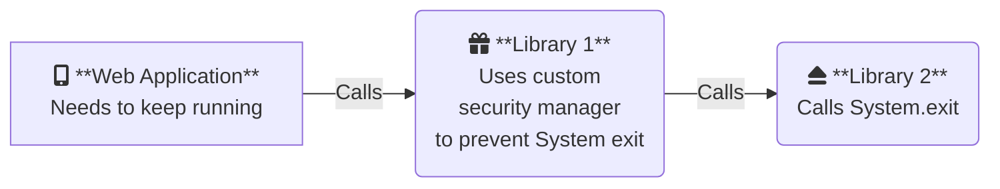

# System Exit 21

> Illustrate differences in `System.exit(...)` in Java 21 versus Java 8

In Java 8, it is possible (easy enough) to substitute a custom security manager which can capture system exit calls, and allow code to continue executing. Java 21 makes this more difficult. However, this can cause a problem for systems that are being upgraded from Java 8 to Java 21, since processes can sometimes fail without any exceptions or logs. This is usually because libraries that used to substitute a custom security manager no longer do that with Java 21. Tracing the source of the error can be difficult.

Consider this use case:



If "Library 1" supports Java 21, and does not substitute a custom security manager, it can cause the "Web application" to terminate without warning.

This project boils the problem down to essentials. We have a simple Java class that calls `System.exit(...)`, which in turn is invoked by Apache Ant. On Java 8, Apache Ant intercepts `System.exit(...)` and the build completes. On Java 21 though, [Apache Ant no longer intercepts `System.exit(...)`](https://github.com/apache/ant/commit/689b6ea90ee1fbad580a437137d80609c9336f12), resulting in a terminated build with no logs or exceptions.

Look at the results for the [GitHub Actions workflows](https://github.com/sualeh/system-exit-21/actions) in Java 8 and Java 21 to see how it might be to locate the source of the error in a complex system. Compare how the build completes in Java 8 (but not so in Java 21) with:
```
[INFO] ------------------------------------------------------------------------
[INFO] BUILD FAILURE
[INFO] ------------------------------------------------------------------------
```
